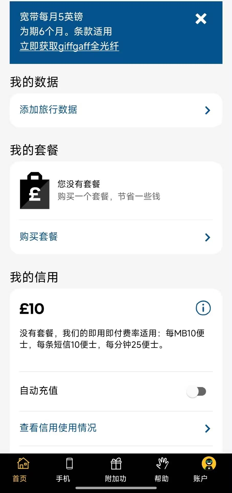
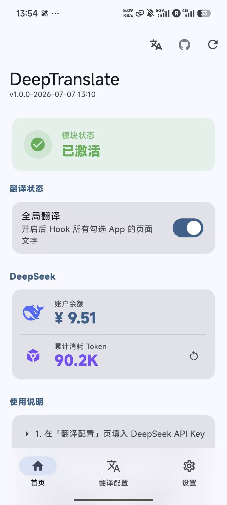
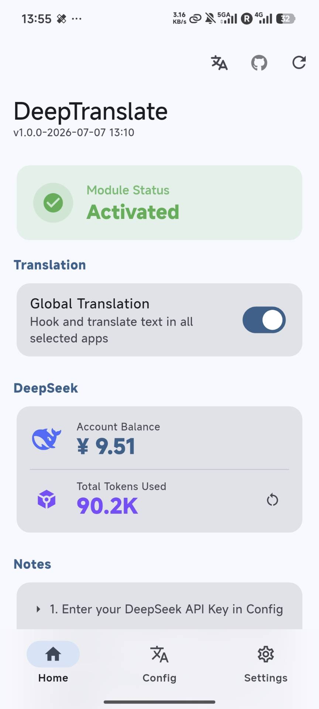

# DeepTranslate

> LSPosed real-time translation module. Hooks native UI text and calls any OpenAI-compatible API.

[中文](README.md)

## Screenshots

| Before | After |
|--------|-------|
|  |  |

| App UI (Chinese) | App UI (English) |
|------------------|------------------|
|  |  |

## Features

- **Global text translation** -- Hooks `TextView.setText()`, plus `StaticLayout` / `BoringLayout`
- **Compose text** -- Hooks `TextLayout` / `AndroidParagraphIntrinsics` when the target app ships Compose
- **WebView** -- Translates visible page text. Skips inputs, scripts, and styles
- **Custom OpenAI-compatible API** -- Base URL (`https://host/v1`) or a full `/chat/completions` URL
- **Custom model** -- Type a model id, or fetch `/models` and pick one. API key can be empty for local servers
- **Contextual batching** -- Short UI text is sent whole, together. Posts are split by paragraph and length
- **SQLite cache** -- The translation is stored for the source text, so the same text is not requested again. Bilingual display is applied on screen and is not cached separately
- **Bilingual display** -- Optional. Short controls show "translation (original)". Posts show the translation, a blank line, then the original
- **Fallback channel** -- After 0–3 retries, a second API is used. Missing lines are retried on their own instead of dropping the batch
- **Span preservation** -- The `TextView.setText` path keeps color, weight, size, and alignment
- **Material 3 UI** -- Layout text, WebView, and Compose can be toggled separately

## Compatibility

| Supported | Not supported |
|-----------|---------------|
| Native TextView (Twitter, Telegram, Reddit, Gmail, etc.) | Flutter (Skia, no TextView) |
| StaticLayout / BoringLayout | React Native / Weex |
| Compose text, when those classes exist | |
| Visible WebView text | |

## Usage

1. Install APK, enable the module in LSPosed
2. Select target apps in LSPosed scope settings
3. Open DeepTranslate -> Config. The URL can be `https://host/v1` or a full `/chat/completions` URL. API key can be empty for a local server. Type a model id, or tap Fetch Models
4. Turn on Global Translation. Layout text, WebView, and Compose can be disabled separately in Settings
5. Restart target apps, text will translate automatically

> The first pass waits a short collection window. Long posts are split across requests. Concurrency, widgets per request, paragraphs, and characters are in Config.

> **Switching target language**: Modify the target language in "Config -> Translation Prompt". For example, change "翻译为中文" to "translate to Japanese", "translated to Spanish", etc.

## Build

```
flutter pub get
flutter build apk --release
```

Pushes to `main` also build on GitHub Actions. The APK is the `deeptranslate-apk` artifact of that run, not a GitHub Release. Without a keystore the APK is signed with the debug key.

Requirements:

- Flutter SDK >= 3.9
- JDK 21
- Android SDK (compileSdk 37)
- LibXposed API 102.0.0

## Architecture

```
Flutter UI (lib/)          Configuration panel (Material 3)
     |  SharedPreferences
XposedService              RemotePreferences cross-process sync
     |
Kotlin Hook (android/)     Runs inside target app processes
  +-- DeepTranslateModule   XposedModule entry, registers broadcast receivers
  +-- TextViewHook          Hooks TextView.setText()
  +-- LayoutHook            StaticLayout / BoringLayout / Compose
  +-- WebViewHook           Visible WebView text
  +-- TextBatcher           UI text and posts are packed separately; long posts are chunked
  +-- TranslationEngine     OpenAI-compatible chat/completions
  +-- TranslationCache      SQLite persistent cache
  +-- LanguageDetector      Fast language detection (CJK character ratio)
```

## OpenAI-compatible API

Any of these is accepted:

| Input | Requests |
|---|---|
| `https://api.deepseek.com/v1` | `…/v1/chat/completions`, model list `…/v1/models` |
| `https://api.openai.com/v1/chat/completions` | Used as the chat URL; model list is the sibling `/models` |
| `http://127.0.0.1:11434/v1` | Local OpenAI-compatible server. API key can be empty |

The default model is still `deepseek-v4-flash`. Replace it with any id the endpoint returns. The protocol is OpenAI chat completions with a Bearer token.

## License

MIT
